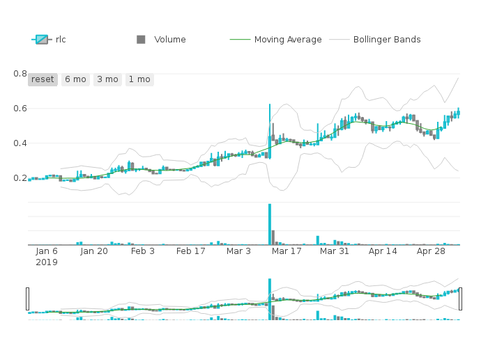
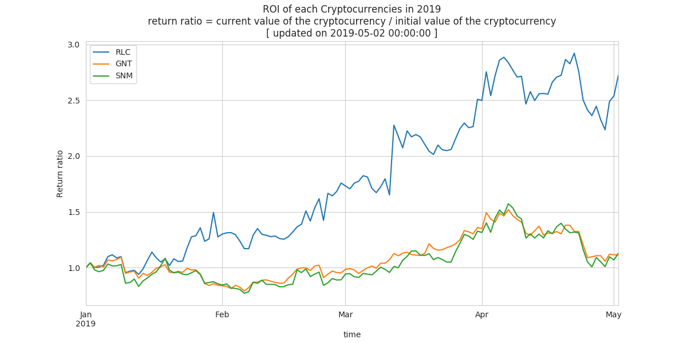
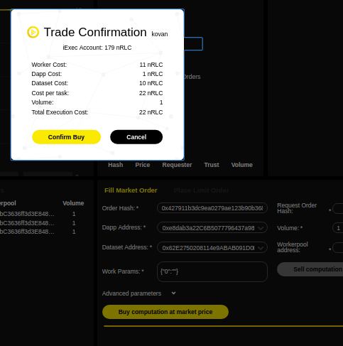

# CloudCoinAnalysis


Analysis of the 3 main cryptocurrencies offering a cloud computing solution:  GOLEM, SONM, IEXEC and Bitcoin.    

The application runs on top of iExec platform and generate a market report, it performs exploratory data analysis, generating graphes, and use a machine learning algorithm to predict the market prices in future 30 days for the 3 cryptocurrencies and also Bitcoin.


## About iExec:

iExec is building the future of the Internet infrastructure by decentralizing the cloud computing market. It is the first blockchain-based cloud computing marketplace.
The iExec network connects cloud resource sellers with cloud resource buyers, encouraging an ecosystem of decentralized and autonomous, privacy-preserving applications.
This network aims at providing companies with scalable, secure and easy access to the services, datasets and computing resources they need. iExec’s technology relies on Ethereum smart contracts and allows for a virtual cloud infrastructure that provides high-performance computing services on-demand.


## Data and algorithm source:

The code is forked from:

* https://github.com/jieyima/Cryptocurrency_Investment_Analysis_and_Modeling for the application
* https://github.com/JesseVent/crypto to build the datasets


## Create and store datasets on your data wallet

The Crypto R package helps to download historical Cryptocurrency Prices using the CoinMarketCap API

### Generate the dataset file

The getcloudcoin.R script generates the csv dataset file, containing the full history for BTC, GNT, SNM and RLC cryptos.

```
 Rscript getcloudcoin.R
```
The script creates locally a cloudcoin_YYYY-MM-DD.csv file.
Then generate the zip file and place it in the dataset repo.
```
zip dataset/cloudcoin_2019-10-29.zip cloudcoin_2019-10-29.csv
 adding: cloudcoin_2019-10-29.csv (deflated 67%)
```

## Installing iExec

Follow instructions to install the SDK and set up your wallet  
https://docs.iex.ec/quickstart.html
and
https://docs.iex.ec/wallet.html

In this demo, 2 wallets have been generated one for for the app developer and one for the data owner: **developer_wallet** and **data_owner_wallet**.      
The sdk options **--wallet_file=** will be used to select the good owner for all commands.
For convenience, you can use your own wallet for both, app and dataset.

### Register the dataset on the blockchain

Let's register the dataset, the dataset is not store on the blockchain ethereum, the blockchain is only use to manage the data ownership, access and monetization.

```
iexec dataset init --wallet-file data_owner_wallet
```
Edit the dataset info in iexec.json file.

The dataset file must have a public access on the web, the dataset has to be accessible from any machines.  

The checksum will be use to check the integrity on the file. The dev is in progress, no need to fill in the checksum for the moment.

```
"dataset": {
  "owner": "0x9CdDC59c3782828724f55DD4AB4920d98aA88418",
  "name": "cloincoin-dataset-20191029",
  "multiaddr": "https://raw.githubusercontent.com/iExecBlockchainComputing/apps/master/CloudCoinAnalysis/dataset/cloudcoin_2019-10-29.zip",
  "checksum": "0x0000000000000000000000000000000000000000000000000000000000000000"
}
```
The dataset is store in github, use the raw prefix to define the file path.
In this example, the git link
```
https://github.com/iExecBlockchainComputing/iexec-tutorials/blob/master/CloudCoinAnalysis/dataset/cloudcoin_2019-10-29.zip
```
has to be replaced by
```
https://raw.githubusercontent.com/iExecBlockchainComputing/apps/master/CloudCoinAnalysis/dataset/cloudcoin_2019-10-29.zip
```

Deploy the dataset with the iExec SDK

```
iexec dataset deploy --wallet-file data_owner_wallet
ℹ using chain [kovan]
? Using wallet data_owner_wallet
Please enter your password to unlock your wallet [hidden]
✔ Deployed new dataset at address 0x9D1C683E607FdE13C76fb248B08E916cd0C55862
```

### Publish selling order for the dataset.

As the dataset is now registered and the ownership is stored on the blockchain; the owner has to publish order defining the price, the volume and restrictions for the usage of the dataset.

```
iexec order init --dataset --wallet-file data_owner_walletℹ using chain [kovan]
✔ Saved default datasetorder in "iexec.json", you can edit it:
dataset:            0x9D1C683E607FdE13C76fb248B08E916cd0C55862
datasetprice:       0
volume:             1000000
tag:                0x0000000000000000000000000000000000000000000000000000000000000000
apprestrict:        0x0000000000000000000000000000000000000000
workerpoolrestrict: 0x0000000000000000000000000000000000000000
requesterrestrict:  0x0000000000000000000000000000000000000000

```

Let's create an order with 10 nRLC cost and a volume of 1000 tasks with no extra restriction, regarding the application or a workerpool or any end-users.
The dataset created should be extensively used.   

Edit the iexec.json file.

```
"datasetorder": {
  "dataset": "0x9D1C683E607FdE13C76fb248B08E916cd0C55862",
  "datasetprice": 10,
  "volume": 1000,
  "tag": "0x0000000000000000000000000000000000000000000000000000000000000000",
  "apprestrict": "0x0000000000000000000000000000000000000000",
  "workerpoolrestrict": "0x0000000000000000000000000000000000000000",
  "requesterrestrict": "0x0000000000000000000000000000000000000000"
}
```

Sign the order

```
iexec order sign --dataset --wallet-file data_owner_walletℹ using chain [kovan]
? Using wallet data_owner_wallet
Please enter your password to unlock your wallet [hidden]
✔ datasetorder signed and saved in orders.json, you can share it:
dataset:            0x9D1C683E607FdE13C76fb248B08E916cd0C55862
datasetprice:       10
volume:             1000
tag:                0x0000000000000000000000000000000000000000000000000000000000000000
apprestrict:        0x0000000000000000000000000000000000000000
workerpoolrestrict: 0x0000000000000000000000000000000000000000
requesterrestrict:  0x0000000000000000000000000000000000000000
salt:               0xd7ed0285e53a666333474c3c2f1b98305577d62dae3501a8892c182d01b230f8
sign:               0x974d30aaa541d736c351fb0bb87f22334547acb23b4bcd0e7212a67d0f03b3d13c98e7783a6ddbcbe81491c516d806c6e06977ea16297d93bb74022ecf1cfde91c
```
and then publish the order

```
iexec order publish --dataset --wallet-file data_owner_wallet
ℹ using chain [kovan]
? Using wallet data_owner_wallet
Please enter your password to unlock your wallet [hidden]
? Do you want to publish the following datasetorder?
dataset:            0x9D1C683E607FdE13C76fb248B08E916cd0C55862
datasetprice:       10
volume:             1000
tag:                0x0000000000000000000000000000000000000000000000000000000000000000
apprestrict:        0x0000000000000000000000000000000000000000
workerpoolrestrict: 0x0000000000000000000000000000000000000000
requesterrestrict:  0x0000000000000000000000000000000000000000
salt:               0xd7ed0285e53a666333474c3c2f1b98305577d62dae3501a8892c182d01b230f8
sign:               0x974d30aaa541d736c351fb0bb87f22334547acb23b4bcd0e7212a67d0f03b3d13c98e7783a6ddbcbe8
1491c516d806c6e06977ea16297d93bb74022ecf1cfde91c
 Yes
✔ datasetorder successfully published with orderHash 0x0cad72bdf9447d3755cd2a55480038c3e4eeb62044b1e9b2f4c2f29ceda9b31e
```

Check the order status

```
iexec order show --dataset 0x0cad72bdf9447d3755cd2a55480038c3e4eeb62044b1e9b2f4c2f29ceda9b31e
ℹ using chain [kovan]
✔ datasetorder with orderHash 0x0cad72bdf9447d3755cd2a55480038c3e4eeb62044b1e9b2f4c2f29ceda9b31e details:
orderHash:            0x0cad72bdf9447d3755cd2a55480038c3e4eeb62044b1e9b2f4c2f29ceda9b31e
order:
  sign:               0x974d30aaa541d736c351fb0bb87f22334547acb23b4bcd0e7212a67d0f03b3d13c98e7783a6ddbcbe81491c516d806c6e06977ea16297d93bb74022ecf1cfde91c
  salt:               0xd7ed0285e53a666333474c3c2f1b98305577d62dae3501a8892c182d01b230f8
  requesterrestrict:  0x0000000000000000000000000000000000000000
  workerpoolrestrict: 0x0000000000000000000000000000000000000000
  apprestrict:        0x0000000000000000000000000000000000000000
  tag:                0x0000000000000000000000000000000000000000000000000000000000000000
  volume:             1000
  datasetprice:       10
  dataset:            0x9D1C683E607FdE13C76fb248B08E916cd0C55862
remaining:            1000
status:               open
publicationTimestamp: 2019-10-30T22:38:27.252Z
signer:               0x9CdDC59c3782828724f55DD4AB4920d98aA88418
```
Now the dataset is deployed and we published dataset order, without restriction, so anyone can use my dataset with an app with the pay per use model. You note that is not sustainable and safe model because anynone should copy the dataset. We'll come back later on this point.      

## Deploy the application

The application is already dockerized and it can process all datasets created with the R script, the data are daily updated.

The application is available at
https://hub.docker.com/r/iexechub/cloudcoin

Source code in the current repository: Dockerfile, cloudcoin.py and entrypoint.sh

### Register applications on the blockchain

The registration is similar to the dataset registration.
First, we will register the application and then publish orders with defining a price, a volume and restrictions.

```
iexec app init
```

Edit iexec.json file, and set up the name, the address and the hash of the docker image
"checksum" is the docker image checksum, obtained with a docker pull command, the hexadecimal number after "digest: sha256:"

```
docker pull registry.hub.docker.com/iexechub/cloudcoin
Using default tag: latest
latest: Pulling from iexechub/cloudcoin
Digest: sha256:5496bd85e2b787b3a84dc7fb53e4d2c952f9eab13419e0f496be7eeefcc66bd6
Status: Image is up to date for registry.hub.docker.com/iexechub/cloudcoin:latest
```
Do not forget to add a "0x" prefix to the hash.

```
"app": {
    "owner": "0x47d0Ab8d36836F54FD9587e65125Bbab04958310",
    "name": "CloudCoin",
    "type": "DOCKER",
    "multiaddr": "registry.hub.docker.com/iexechub/cloudcoin",
    "checksum": "0x5496bd85e2b787b3a84dc7fb53e4d2c952f9eab13419e0f496be7eeefcc66bd6",
    "mrenclave": ""
  },
```

Deploy the application

```
iexec app deploy --wallet-file developer_wallet
ℹ using chain [kovan]
? Using wallet developer_wallet
Please enter your password to unlock your wallet [hidden]
✔ Deployed new app at address 0xbE55B58a1e1389C453A9DDf4fEe646aB2fcccA88

```

### Publish an app order

Create the  configuration section in iexec.json

```
iexec order init --app

ℹ using chain [kovan]
✔ Saved default apporder in "iexec.json", you can edit it:
app:                0xbE55B58a1e1389C453A9DDf4fEe646aB2fcccA88
appprice:           0
volume:             1000000
tag:                0x0000000000000000000000000000000000000000000000000000000000000000
datasetrestrict:    0x0000000000000000000000000000000000000000
workerpoolrestrict: 0x0000000000000000000000000000000000000000
requesterrestrict:  0x0000000000000000000000000000000000000000

```

Set up price, volume and restriction
For this app, restriction are not required.
Sign and publish app order

Price : 1 nRLC
Volume : 1000

```
iexec order sign --app --wallet-file developer_wallet
ℹ using chain [kovan]
? Using wallet developer_wallet
Please enter your password to unlock your wallet [hidden]
✔ apporder signed and saved in orders.json, you can share it:
app:                0xbE55B58a1e1389C453A9DDf4fEe646aB2fcccA88
appprice:           1
volume:             1000
tag:                0x0000000000000000000000000000000000000000000000000000000000000000
datasetrestrict:    0x0000000000000000000000000000000000000000
workerpoolrestrict: 0x0000000000000000000000000000000000000000
requesterrestrict:  0x0000000000000000000000000000000000000000
salt:               0x03b14a6ba49a5a8a8a3c5cd51c646a93967d27763e63d6ff7adbbb43630afbfd
sign:               0x5ea9399d0c673e6d1e07e84cb7214129405dba5f791281369732d039ea8fd3bd71fd5af2adf68366c60dc289564fb1920ba9c55066dc458080112ba7c1cfd6351c
```

```
iexec order publish --app --wallet-file developer_wallet
ℹ using chain [kovan]
? Using wallet developer_wallet
Please enter your password to unlock your wallet [hidden]
? Do you want to publish the following apporder?
app:                0xbE55B58a1e1389C453A9DDf4fEe646aB2fcccA88
appprice:           1
volume:             1000
tag:                0x0000000000000000000000000000000000000000000000000000000000000000
datasetrestrict:    0x0000000000000000000000000000000000000000
workerpoolrestrict: 0x0000000000000000000000000000000000000000
requesterrestrict:  0x0000000000000000000000000000000000000000
salt:               0x03b14a6ba49a5a8a8a3c5cd51c646a93967d27763e63d6ff7adbbb43630afbfd
sign:               0x5ea9399d0c673e6d1e07e84cb7214129405dba5f791281369732d039ea8fd3bd71fd5af2adf68366c6
0dc289564fb1920ba9c55066dc458080112ba7c1cfd6351c
 Yes
✔ apporder successfully published with orderHash 0xe8b6639bf376d9f250c8e751ba22d305269bf75ee3675685cb2b21fd826431c3
```

### Test locally the app with dataset

```
rm -rf iexec_in iexec_out
mkdir iexec_in iexec_out;
cp dataset/cloudcoin_2019-10-29.zip iexec_in/. ; docker run -v `pwd`/iexec_in:/iexec_in -v `pwd`/iexec_out:/iexec_out -e IEXEC_DATASET_FILENAME="cloudcoin_2019-10-29.zip" iexechub/cloudcoin
```

### Improve the security for the access to the dataset:

Use dataset encryption and whitelisting of application  
The data registration workflow is similar.

```
iexec dataset init --encrypted

ℹ Created dataset folder tree for encryption
✔ Saved default dataset in "iexec.json", you can edit it:
owner:     0xfD4221dc0a8771F3Aa387EB4C0592d44D3cd671b
name:      my-dataset
multiaddr: /ipfs/QmW2WQi7j6c7UgJTarActp7tDNikE4B2qXtFCfLPdsgaTQ
checksum:  0x0000000000000000000000000000000000000000000000000000000000000000

```
Copy the dataset in .datasets/original/

```
cp dataset/cloudcoin_2019-10-29.zip datasets/original/
```

Encrypt the dataset
```
iexec dataset encrypt
ℹ Using default encryption aes-256-cbc
ℹ Encrypting cloudcoin_2019-10-29.zip
ℹ Generated secret for cloudcoin_2019-10-29.zip in /home/eric/apps/CloudCoinAnalysis/.secrets/datasets/cloudcoin_2019-10-29.zip.secret
ℹ Generated encrypted file for cloudcoin_2019-10-29.zip in /home/eric/apps/CloudCoinAnalysis/datasets/encrypted/cloudcoin_2019-10-29.zip.enc
✔ Encrypted datasets stored in "/home/eric/apps/CloudCoinAnalysis/datasets/encrypted", you can publish the encrypted files.
Datasets keys stored in "/home/eric/apps/CloudCoinAnalysis/.secrets/datasets", make sure to backup them.
Once you deploy an encrypted dataset run "iexec dataset push-secret [datasetAddress]" to securely share the dataset key with the workers.

```

It produces the secret key for decrypting the dataset

```
    cat ./.secrets/dataset/myAwsomeDataset.file.secret
```
and the encrypted dataset, you must share at a public url

Push the secret in the Secret Management Service (sms)

```
iexec dataset push-secret --wallet-file data_owner_wallet
ℹ using chain [kovan]
? Using wallet data_owner_wallet
Please enter your password to unlock your wallet [hidden]
ℹ No --secret-path <path> option, using default /home/eric/apps/CloudCoinAnalysis/.secrets/datasets/dataset.secret
✔ Secret successfully pushed (hash: 9ba2dc5d087b8a1e6e0ab58bc31dfc62101d10671b9d20d2f2ad3055d7ce9681)
```

```
iexec dataset deploy --wallet-file data_owner_wallet
ℹ using chain [kovan]
? Using wallet data_owner_wallet
Please enter your password to unlock your wallet [hidden]
✔ Deployed new dataset at address 0x4DC61D8a028a600e4514A54053e07C61A1fA0Ee9
```

```
iexec order sign --dataset --wallet-file data_owner_walletℹ using chain [kovan]
? Using wallet data_owner_wallet
Please enter your password to unlock your wallet [hidden]
✔ datasetorder signed and saved in orders.json, you can share it:
dataset:            0x4DC61D8a028a600e4514A54053e07C61A1fA0Ee9
datasetprice:       20
volume:             100
tag:                0x0000000000000000000000000000000000000000000000000000000000000000
apprestrict:        0x0000000000000000000000000000000000000000
workerpoolrestrict: 0x0000000000000000000000000000000000000000
requesterrestrict:  0x0000000000000000000000000000000000000000
salt:               0x9daf409d23d998936e871f9e4e7a992814c440cebcae9330647e33f32b018904
sign:               0xb37b0032084496e2f22167a55b95c4d40f9551ebecc045a5ccaf2f5d27491e7c68bcafeda7a64bea0a4252008317c8f5c92def5cdbf718023633df6414c3311a1c
```

```
iexec order publish --dataset --wallet-file data_owner_wallet
ℹ using chain [kovan]
? Using wallet data_owner_wallet
Please enter your password to unlock your wallet [hidden]
? Do you want to publish the following datasetorder?
dataset:            0x4DC61D8a028a600e4514A54053e07C61A1fA0Ee9
datasetprice:       20
volume:             100
tag:                0x0000000000000000000000000000000000000000000000000000000000000000
apprestrict:        0x0000000000000000000000000000000000000000
workerpoolrestrict: 0x0000000000000000000000000000000000000000
requesterrestrict:  0x0000000000000000000000000000000000000000
salt:               0x9daf409d23d998936e871f9e4e7a992814c440cebcae9330647e33f32b018904
sign:               0xb37b0032084496e2f22167a55b95c4d40f9551ebecc045a5ccaf2f5d27491e7c68bcafeda7a64bea0a
4252008317c8f5c92def5cdbf718023633df6414c3311a1c
 Yes
✔ datasetorder successfully published with orderHash 0xc96f4ae21f14f8cf573448ac3f9b3f3aaf565bc071b11b370be7d25b9603bfa0
```


## Buy a crypto coin analysis and get your daily report

Your report contains a market report with a collection of plots    

Daily candlestick for RLC token :  



Return on Investments in 2019 :



### Method 1: from the marketplace

https://v3.market.iex.ec.

This is possible to process a cloud coin analysis from the marketplace,    
You only need the fill in the dataset and the dapp addresses you just created and deployed, the marketplace is able to find the corresponding orders behind the scene.
The corresponding addresses were given by **iexec app deploy** and **iexec dataset deploy** command



### Method 2 : using requestorder

TBD

## Get updated data

The information from CoinMarketCap website are daily updated, so new dataset can be created everyday. The application is self-adapted to date changes.
Feel free to propose improvement or develop your own analysis.  

## Future work/next step:

 * Improve data visualization and prediction algorithmes.
 * Use iExec security layers (Trusted execution environment) for data privacy.
